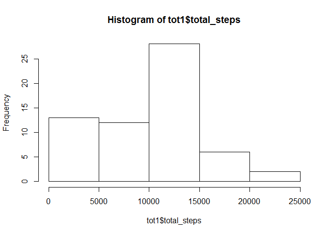
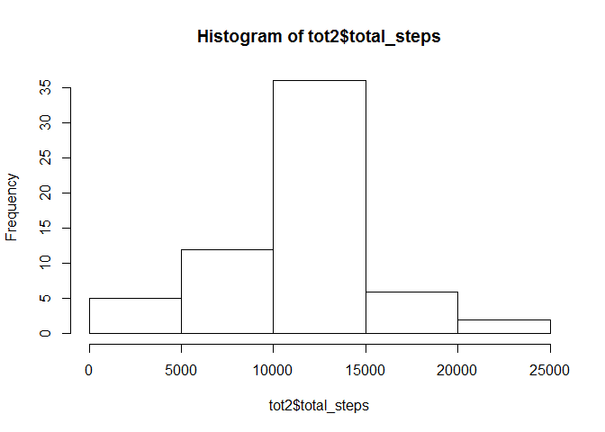
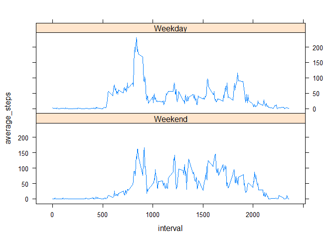

# Reproducible Research: Peer Assessment 1


## Loading and preprocessing the data
This step loads the input dataset provided


```r
fil1 <- read.csv("C:/Users/Padma/Documents/Coursera/RepRes/RepData_PeerAssessment1/Activity.csv",
      header=TRUE, sep=",", as.is=TRUE)
```

## What is mean total number of steps taken per day?
Dataframe tot1 computes the total steps by day to facilitate graphing
The summary function is used to work out the mean and median of the total number of steps taken per day

```r
tot1 <- aggregate(fil1$steps,list(fil1$date),FUN=sum,na.rm=TRUE, na.action=NULL)
colnames(tot1) <- c('date','total_steps')
hist(tot1$total_steps)
```

 

```r
summary(tot1$total_steps) ##reports mean, median
```

```
##    Min. 1st Qu.  Median    Mean 3rd Qu.    Max. 
##       0    6778   10400    9354   12810   21190
```

## What is the average daily activity pattern?
Dataframe avg1 computes the average by interval enabling the plotting
The Which.max function is used to identify the interval with the highest number of steps

```r
avg1 <- aggregate(fil1$steps,list(fil1$interval),FUN=mean,na.rm=TRUE, na.action=NULL)
colnames(avg1) <- c('interval','average_steps')
plot(average_steps ~ interval,avg1, type='l')
```

 

```r
avg1[which.max(avg1$average_steps),1:2]
```

```
##     interval average_steps
## 104      835      206.1698
```

## Imputing missing values
The number of missing values is calculated by the sum function
New dataframe fil1nona is a copy of the original dataframe with the missing number of steps replaced by the average
for that interval (extracted from the avg1 dataframe)
dataframe tot2 computes the total number of steps (all missing values filled out) enabling easy plotting
The summary commands of the 2 dataframes tot1 & tot2 can be used to infer that mean & the median values have changed with the imputation process

```r
sum(is.na(fil1$steps))
```

```
## [1] 2304
```

```r
fil1nona <- fil1
while (sum(is.na(fil1nona$steps)) > 0) {
  fil1nona$steps[is.na(fil1nona$steps)] <- avg1$average_steps[avg1$interval == fil1nona$interval[is.na(fil1nona$steps)]]
}
tot2 <- aggregate(fil1nona$steps,list(fil1nona$date),FUN=sum,na.rm=TRUE, na.action=NULL)
colnames(tot2) <- c('date','total_steps')
hist(tot2$total_steps)
```

 

```r
summary(tot1$total_steps) ##reports mean, median
```

```
##    Min. 1st Qu.  Median    Mean 3rd Qu.    Max. 
##       0    6778   10400    9354   12810   21190
```

```r
summary(tot2$total_steps) ##reports mean, median
```

```
##    Min. 1st Qu.  Median    Mean 3rd Qu.    Max. 
##      41    9819   10770   10770   12810   21190
```
## Are there differences in activity patterns between weekdays and weekends?
Dataframe fil1nonan1 has the additonal FACTOR column wdayf. This is derived by the use of the strftime function that results in the day of the week (sun= 0 thru sat=6). This is then converted to a factor (0=weekend, 1 =weekday).
The xyplot can then be used to generate the required plot using the wdayf as a factor

```r
fil1nona1 <- cbind(fil1nona,wdayf=ifelse( as.integer((strftime(fil1nona$date, format="%w"))) == 0 | as.integer((strftime(fil1nona$date, format="%w"))) == 6 , 1 , 2)
)
fil1nona1$wdayf <- as.factor(fil1nona1$wdayf)
levels(fil1nona1$wdayf) = c('Weekend' , 'Weekday')
avg2 <- aggregate(fil1nona1$steps,list(fil1nona1$interval,fil1nona1$wdayf),FUN=mean,na.rm=TRUE, na.action=NULL)
colnames(avg2) <- c('interval','wdayf','average_steps')
levels(avg2$wdayf) = c('Weekend' , 'Weekday')

library("lattice")
xyplot(average_steps ~ interval | wdayf, avg2, layout = c(1,2) ,type='l')
```

 


